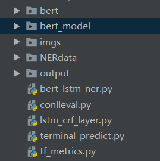
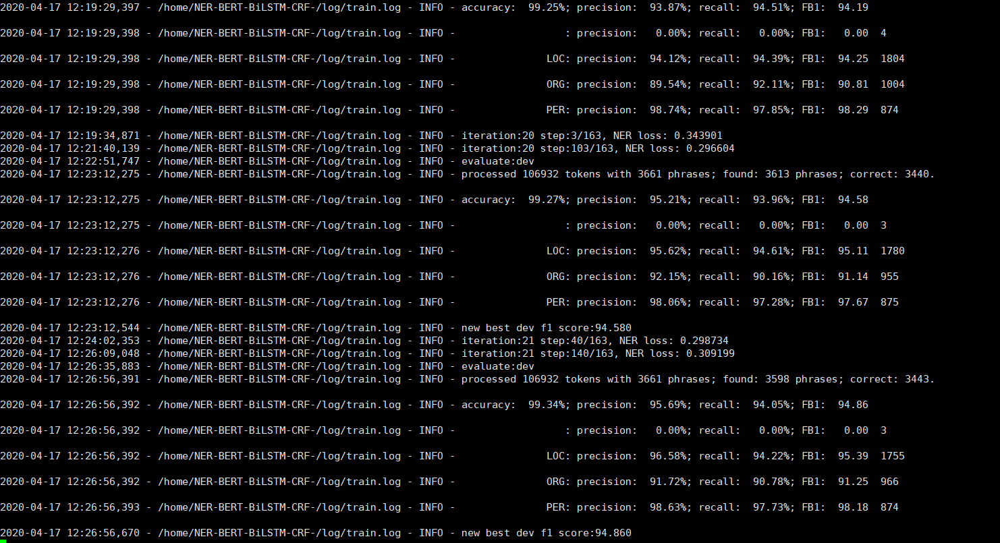
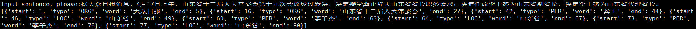

# 基于BERT+BiLSTM+CRF实现中文命名实体识别
## 1、目录结构
<ul>
    <li>data: 训练数据集</li>
    <li>models: 构造的模型</li>
    <li>result: 存放结果</li>
    <li>ckpt: 存放模型的文件夹</li>
    <li>log: 日志</li>
    <li>conlleval.py: 计算模型性能用</li>
    <li>data_helper: 数据处理</li>
    <li>run.py: 执行程序</li>
    <li>train_val_test.py: 训练、验证和测试</li>
    <li>utils.py: 包含一些用到的功能</li>
</ul>

## 2、数据
<ul>
    <li><a href="https://github.com/CLUEbenchmark/CLUEDatasetSearch">开源数据集集合</a></li>
    <li>本项目用到的数据集，在data下README的网盘链接上</li>
</ul>

## 3、运行
下载bert到项目路径 
创建bert_model路径，将预训练好的bert模型放到这个路径下解压 
具体结构如下：

python3 run.py --mode xxx  
xxx: train/test/demo，默认为demo

## 4、效果
训练过程:

单句测试：

## 5、参考
[1] https://github.com/yumath/bertNER
[2] https://github.com/google-research/bert
